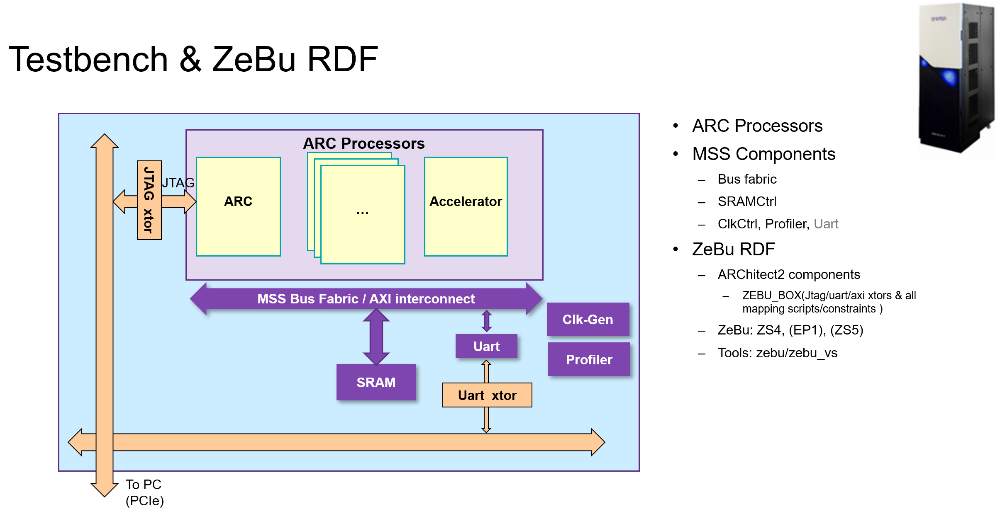
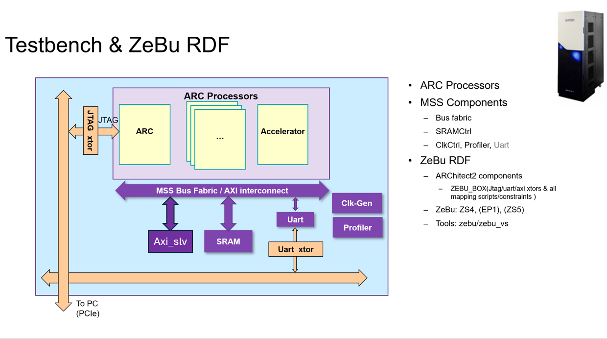

## Overview

This directory mainly consists of two main directories:

- `RMX100_ZS5`
- `RMX100_ZS5_added_axi_slave`

---

### RMX100_ZS5

This directory includes:

1. The build directory of the design provided from IP Team:  
   [build](./RMX100_ZS5/zebu_ifx_mini_rattle_6649a592_20250509/build)

2. The image representing the design (note: UART is not in the design; instead, an AXI master transactor exists):  
   

3. The `.apr` file which can be used in the Architect tool to modify this build directory (add/remove components):  
   [zebu_ifx_mini_rattle_6649a592_20250509.apr](./RMX100_ZS5/zebu_ifx_mini_rattle_6649a592_20250509/zebu_ifx_mini_rattle_6649a592_20250509.apr)

4. This directory is mainly used as a starting point to compile and run the `hello_world` test application to verify correct functionality. It is then used to add the AXI slave component and generate a new build for further development.

---

### RMX100_ZS5_added_axi_slave

This directory was generated by opening the previous build directory in the Architect tool and adding the `axi_slave_transactor` component to the existing build. It contains the updated build with the added component.

This is the main directory used for development, as it includes the `axi_slave_transactor` in its build which is required for work in the digital twin environment.

This directory includes:

1. The modified build directory after adding axi_slave_transactor  
   [build](./RMX100_ZS5_added_axi_slave/zebu_ifx_mini_rattle_6649a592_20250509/build)

2. The image representing the modified design:  
   

3. The `.apr` file which can be used in the Architect tool to further modify this build directory:  
   [zebu_ifx_mini_rattle_6649a592_20250509.apr](./RMX100_ZS5_added_axi_slave/zebu_ifx_mini_rattle_6649a592_20250509/zebu_ifx_mini_rattle_6649a592_20250509.apr)
   
4. The detailed working in this directory (as this is the main working directory) is explained in its own README file:  
   [Detailed README](./RMX100_ZS5_added_axi_slave/zebu_ifx_mini_rattle_6649a592_20250509/README.md)

